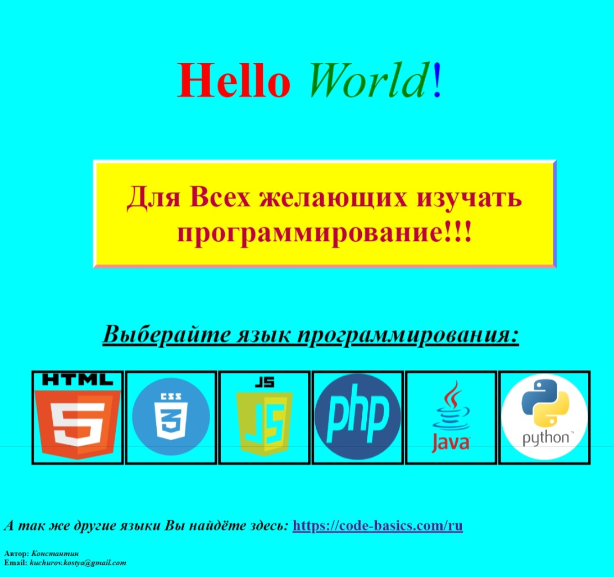
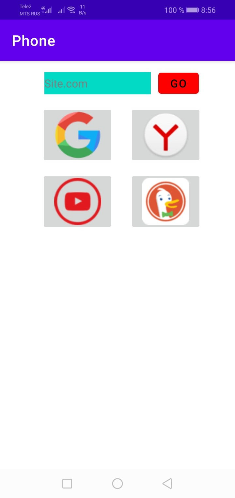
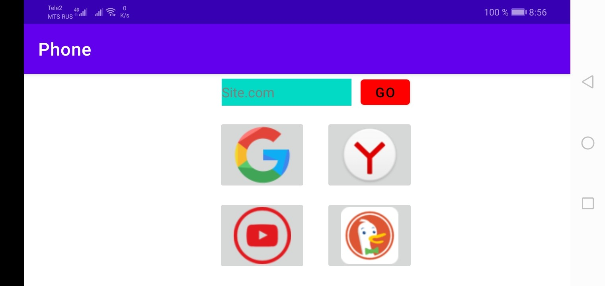

# Этот репозиторий - Моя пробная разметка (вёрстка)  сайта.
В этом репозитории показан __код__ создания __страницы__, её разметка, оформление и связь файлов между собой. А так же связь с __сайтом__ по ссылке.
На данной __странице__ идёт описание по бесплатным курсам __языков__ программирования, для ___Всех___ желающих изучать __IT - сферу.__
Для его создания ___Я___ изучил языки программирования: __HTML__, __CSS__, __JavaScript__ на различных сайтах и форумах. Больше всего понятными и удобными оказались бесплатные уроки на сайте по __ссылке:__ [https://code-basics.com/ru](https://code-basics.com/ru)
Весь код был оформлен в редакторе кода __Visual Studio Code__ на операционной системе __Windows 10__.
Для опубликования данного репозитория, ___Мне___ необходимо было установить __Git__ и зарегистрироваться на __GitHub.com__

__Скриншот страницы:__

***
Мне уже были знакомы языки __Python__ и __Java__. С зтими языками ___Я___ работал в основном на машине __Linux (Ubuntu)__, где на __Java__, в редакторе кода __Android Studio__, было ___Мною___ создано приложение   __Browsers Web TV__, которое доступно в __Google Play__ или можно посмотреть код на __GitHub__ по __ссылке:__ [https://github.com/KonstantinKuchurov/BrowsersWebTV.git](https://github.com/KonstantinKuchurov/BrowsersWebTV.git)  
Это пробное приложение состоит из простого списка существующих ___браузеров.___

__Скриншоты:__

***
__Email для связи:__

<c.o.c.k.s@mail.ru>

<kuchurov.kostya@gmail.com>
